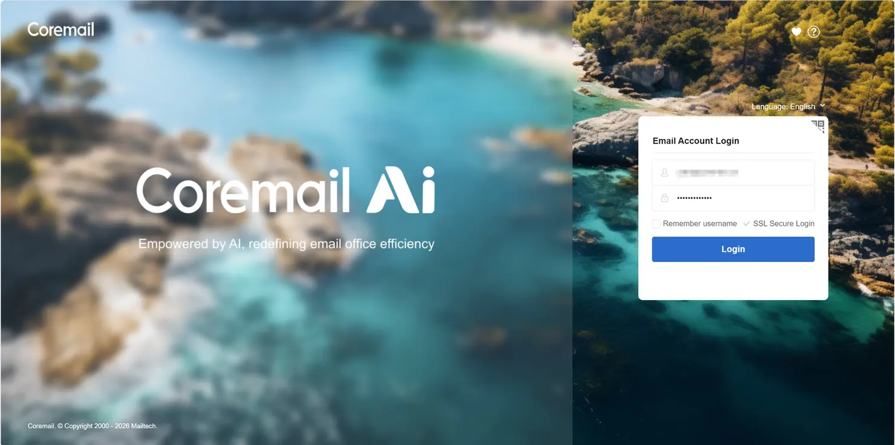
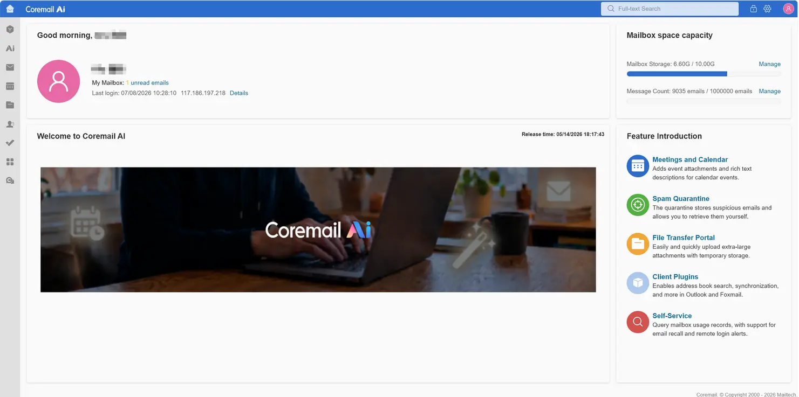
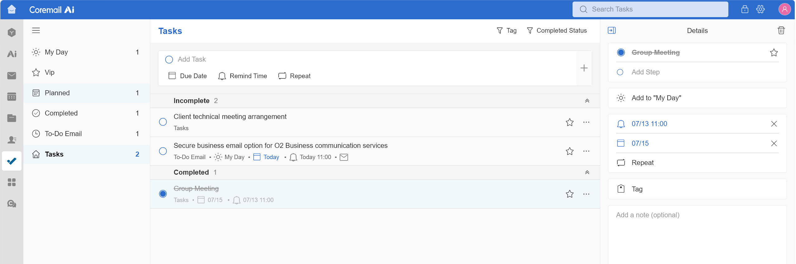
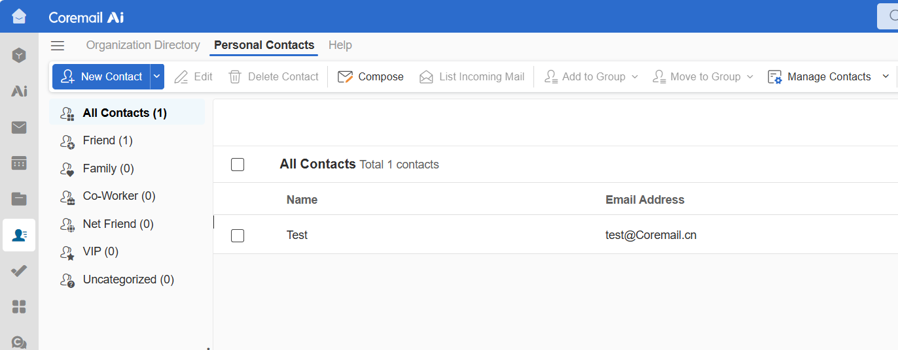
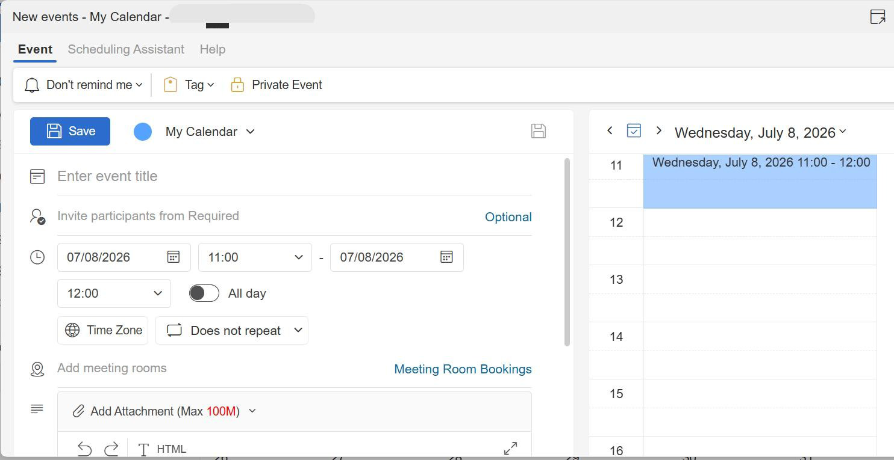

# Coremail Sync

💌 A Coremail synchronization bridge for Nextcloud

Coremail Sync connects Coremail with Nextcloud Contacts and Calendar, allowing users to synchronize Coremail contact and calendar data into native Nextcloud apps for easier access and unified daily use.

• 🚀 Sync Coremail contacts and calendars!

Import Coremail CardDAV contacts and CalDAV calendar items into native Nextcloud Contacts and Calendar.

• 🔄 One-way synchronization from Coremail to Nextcloud!

Synchronize Coremail data into Nextcloud so users can view their contacts and calendar items directly in the standard Nextcloud apps.

• 📇 Native Nextcloud Contacts and Calendar integration!

Synced data is stored in native Nextcloud address books and calendars, ensuring users can access it through the familiar Nextcloud Contacts and Calendar interfaces.

• ⏱️ Manual and scheduled synchronization!

Users can run synchronization manually when needed, while Nextcloud cron can perform scheduled synchronization based on the configured interval.

• ⚙️ Administrator-managed connection settings!

Administrators can configure the default Coremail DAV endpoint, while users can connect their own Coremail account for synchronization.

Current scope

The current version focuses on one-way synchronization from Coremail to Nextcloud. Changes made in Coremail can be synchronized into Nextcloud, while changes made in Nextcloud are not yet synchronized back to Coremail.

Future iterations may extend the bridge with two-way synchronization, conflict handling, deletion synchronization, improved environment adaptation, and more advanced production management capabilities.

About Coremail

Coremail is an enterprise-grade email system designed for large-scale organizational communication. It supports high-concurrency mail services, centralized administration, secure mail delivery, and flexible deployment models. With stable mail, contact, calendar and other capabilities, Coremail helps organizations manage daily communication efficiently while ensuring reliability, security, and ease of administration.

